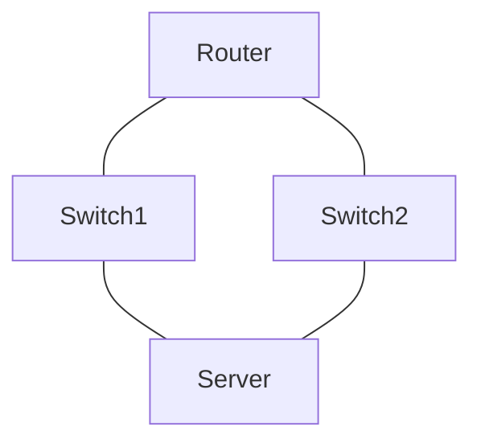
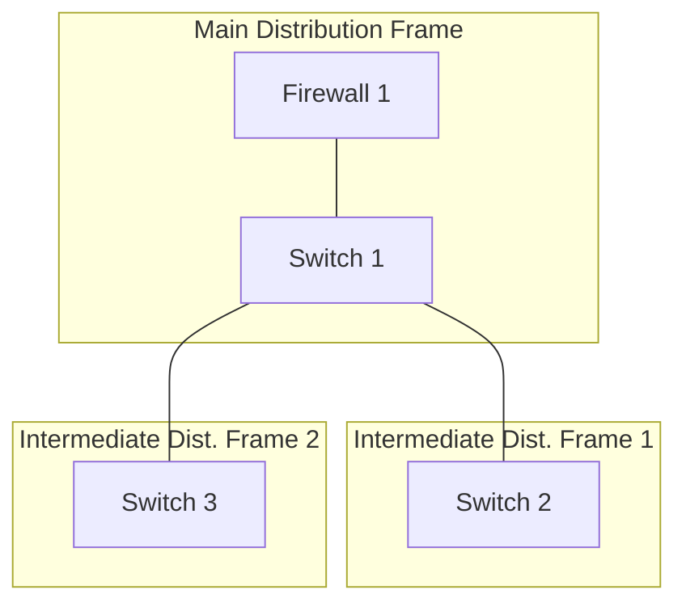
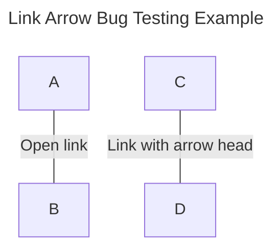

# Mermaid Diagram Notes

## Simple Network Diagram

While there is no native diagram type for computer networks, 
some of the existing diagram types can be used to approximate a network topology.
* [New diagram type: network topology (Issue #1227)][1]

## Graph Top Down Example

It appears that in Mermaid `flowchart` and `graph` are alternative keywords for the same type of diagram. 
* [Flowcharts - Basic Syntax][2]. "*Instead of flowchart one can also use graph.* "



## Subgraph Example

Subgraphs can be used to group related elements. This might be useful to indicate a region, building, floor, room, etc.



## Mermaid Version-specific Bug Troubleshooting

There are some bugs like "Open link" displaying as "Link with arrow head." Use the `info` option to show the Mermaid version.
* For the Open Link / Edge Arrowhead issue, it may have been fixed in Version 11.5.0?
  * [Release Mermaid 11.5.0 Changes][3] Search for: Edge, Arrow.
  * [fix: Display no arrows for open links #6093][4]



```mermaid
info
```
[1]: https://github.com/mermaid-js/mermaid/issues/1227
[2]: https://mermaid.js.org/syntax/flowchart.html
[3]: https://github.com/mermaid-js/mermaid/pull/6374
[4]: https://github.com/mermaid-js/mermaid/pull/6093#issuecomment-2734046994
